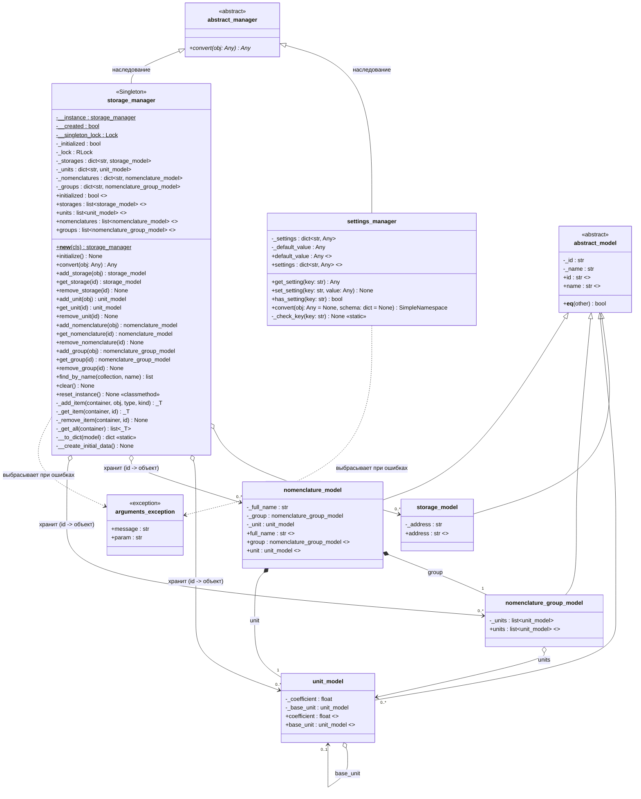
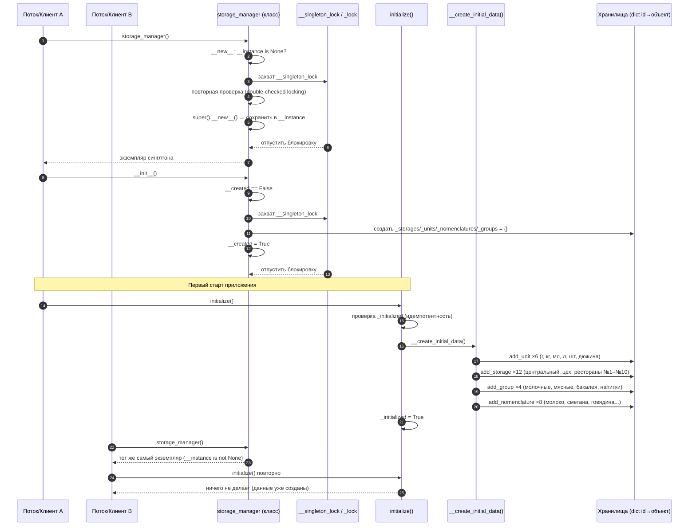

# UML-диаграммы менеджеров: `settings_manager` и `storage_manager`

> Диаграммы выполнены в формате Mermaid (markdown).
> Ветки: `feat/caching`, код: `Src/Core/abstract_manager.py`, `Src/Core/settings_manager.py`, `Src/Core/storage_manager.py`.

---

## 1. Диаграмма классов (Class Diagram)

Общая структура: оба менеджера наследуют абстрактный класс `abstract_manager`
и переопределяют шаблонный метод `convert`. `storage_manager` реализован
как потокобезопасный **Singleton** и оперирует доменными моделями,
наследующими `abstract_model`.

**Примечания:**
- `$` — статические/классовые атрибуты (реализация Singleton у `storage_manager`).
- У `-` членов — приватное состояние; публичный доступ только через свойства/методы.
- `convert` — шаблонный метод `abstract_manager`: у `settings_manager` преобразует
  настройки → типизированный `SimpleNamespace` по схеме; у `storage_manager` —
  модель ↔ канонический словарь (`type/id/name` + поля).

---

## 2. Диаграмма последовательности: Singleton + первый старт `storage_manager`

