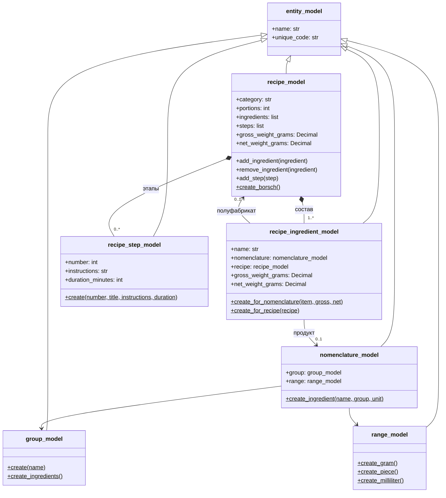

# UML моделей технологических карт

Каждая строка состава ссылается ровно на продукт или на вложенную технологическую
карту полуфабриката. Вес рецепта рекурсивно суммирует массу брутто и нетто строк;
значения хранятся в граммах. Добавление вложенной карты запрещает циклические
зависимости.
